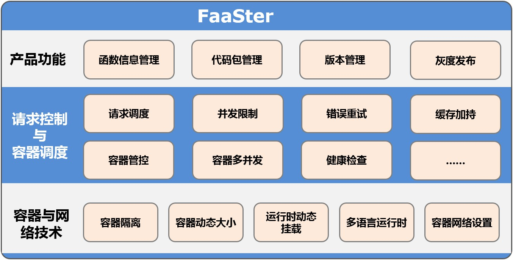
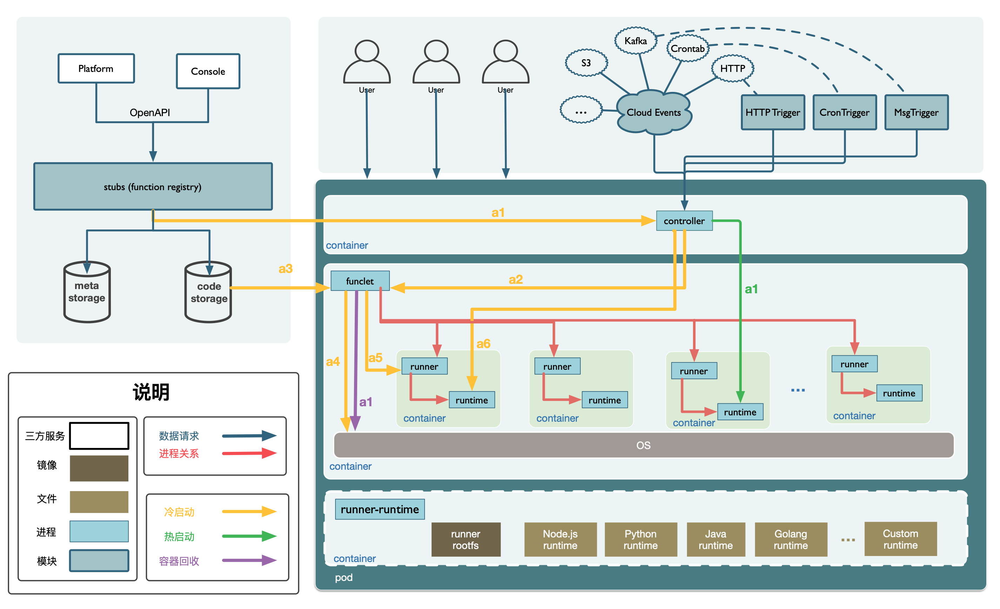

# FaaSter

## 简介

FaaSter是一个依赖轻、适配性强、资源占用少、无状态且高性能的函数计算服务引擎。它有以下几个特点：

- **依赖轻**：FaaSter只依赖Linux内核，不强制依赖Docker、Kubernetes等外部服务

- **适配性强**：FaaSter可以运行在多种系统环境，包括Docker、Kubernetes及裸机等

- **资源占用少**：模块少，服务系统模块占用更小

- **无状态**：每个FaaSter Pod本身无状态且内部自治

- **高性能**：调度链路更短，更小的系统开销和更优的性能

适用于：
- 边缘计算-Edge

- 物联网-IoT

- CICD

- 私有化

- CDN

## 使用手册
[快速开始](./docs/quick_start.md)

[开发手册](./docs/development.md)

[质量测试](./docs/test.md)

[引擎测评](docs/func-registry.md)

## 核心功能

- 提供基于事件机制，按需弹性伸缩的计算能力。

- 支持多种语言运行时，开发者只需使用适合的语言编写自定义函数，无需管理底层基础设施。

- 负责用户容器的全生命周期管理。

- 支持用户配置函数的容器资源容量，提供动态的容器容量调度。

- 支持同步和异步两种调用模式，支持多种可扩展的事件触发器。

- 支持可自定义的函数管理服务。

- 支持自定义语言运行时。 

- 支持多种运行平台，包括Docker、Kubernetes及裸机等。

## 技术架构

### 架构图

FaaSter以单Pod为最小服务单位，每个Pod中包含3个容器，分别为controller、funclet和runner-runtime。其中runner-runtime仅为init容器，准备必要的资源后即退出。

### 模块说明
#### 1. 核心组件

**1.1 controller**

  负责流量调度及容器池状态管理。

- 实现容器调度功能。
- 支持配置函数级别的并发。
- 支持容器状态管理，按策略调度容器状态。
- 支持健康检查，可以根据runtime的状态决定cooldown/reborn。

**1.2 funclet**

   负责管理用户工作容器，包括基础容器资源及函数运行资源。

- 容器管理：实现容器的init/warmup/reset流程。
- 网络管理：实现容器网络相关功能，合理管理网络资源。
- 挂载管理：实现用户容器的动态挂载，并定期回收用户容器的挂载目录。
- 进程管理：需妥善管理用户容器产生的子进程，处理异常退出的子进程。
- 资源容量管理：实现用户工作容器的内存资源动态调整。

**1.3 runner-runtime**

   runner负责管理用户函数运行时，runtime支持各开发语言运行时，目前该组件当前仅提供容器镜像。

#### 2. 可插拔组件
**2.1 httptrigger组件**
   核心功能：扩展函数触发方式，支持HTTP请求触发函数调用
   HTTP触发器实现了将某个函数关联到一个 URL 上，它可以接收 HTTP 请求，根据 HTTP 方法、URL，找到匹配的函数将 HTTP 相关信息传入并执行函数，获取执行结果，将函数执行结果包装为 HTTP 返回响应。

**2.2 stubs组件**
   核心功能： 提供本地函数代码存储服务

- 存储用户函数到本地工作目录

- 支持直接调用本地函数代码

## 贡献

issues贡献： 如在使用中遇到问题，请在 https://github.com/baidu/faaster/issues 新建 issues 反馈问题。

## 维护者
- [郑然](https://github.com/elithnever)
- [房丽颖](https://github.com/flyingfang)
- [史南胜](https://github.com/sns1988)
- [邢龙胜](https://github.com/xinglsh6937)
- [何守芬](https://github.com/sunshineing)
- [吴红霞](https://github.com/smilewhxlucky)

## 版本更新
- 1.0.0 faaster第一版发布，具备常用的函数管控、容器管理和调度、事件机制等功能；

## 讨论

如果您有任何意见或问题都可以提issue到github或gitee，我们将及时为您解答。

如在使用中遇到问题，快速沟通，可微信扫描二维码，加入faaster技术交流群，添加下列管理员微信，并备注“faaster”，管理员邀您入群

